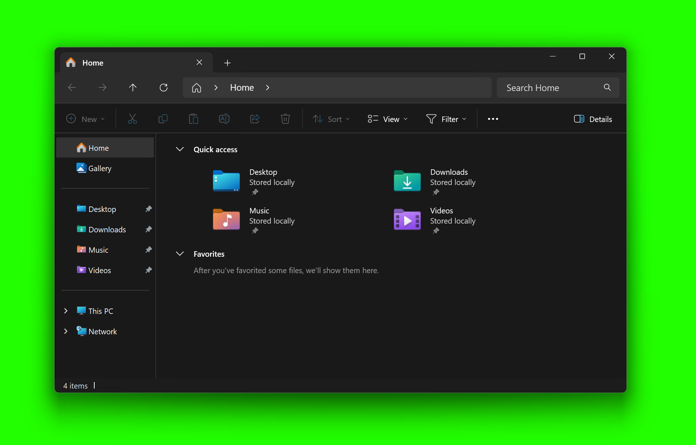

### ChromaClipboard
Chroma key the image in your clipboard

<br />
<br />
<br />
<br />

# About

Small Windows utility to chroma key the image in your clipboard

# Usage

1. Run the application (it runs in the system tray)
1. Copy an image to your clipboard
1. Press `Ctrl+Shift+K` to chroma key the image in your clipboard
1. Press `Ctrl+V` to paste the chroma keyed image into any application

# Green Screen

The release provided is specifically for `#22FF00`

> This will be configurable in the future

# Example

If I'm making a tutorial and I have this image in my clipboard:



This is the result after pressing `Ctrl+Shift+K`:


# License

Use however, no attribution required.

```
BSD Zero Clause License (SPDX: 0BSD)

Permission to use, copy, modify, and/or distribute this software for any purpose
with or without fee is hereby granted.

THE SOFTWARE IS PROVIDED "AS IS" AND THE AUTHOR DISCLAIMS ALL WARRANTIES WITH
REGARD TO THIS SOFTWARE INCLUDING ALL IMPLIED WARRANTIES OF MERCHANTABILITY AND
FITNESS. IN NO EVENT SHALL THE AUTHOR BE LIABLE FOR ANY SPECIAL, DIRECT,
INDIRECT, OR CONSEQUENTIAL DAMAGES OR ANY DAMAGES WHATSOEVER RESULTING FROM LOSS
OF USE, DATA OR PROFITS, WHETHER IN AN ACTION OF CONTRACT, NEGLIGENCE OR OTHER
TORTIOUS ACTION, ARISING OUT OF OR IN CONNECTION WITH THE USE OR PERFORMANCE OF
THIS SOFTWARE.
```
